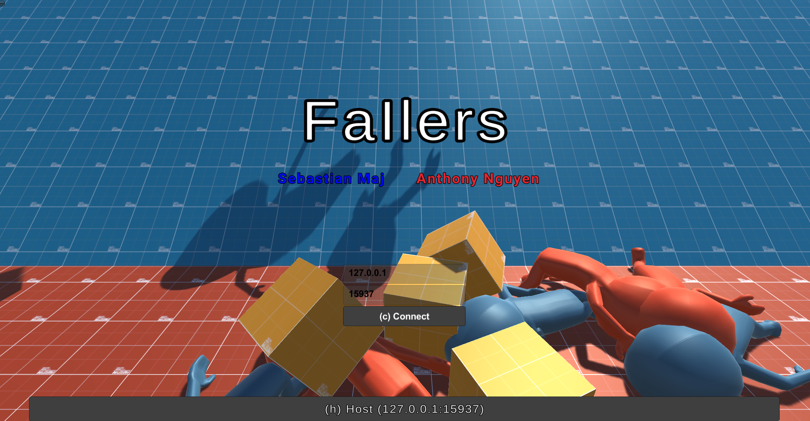

<h1>🔵 FaIlers 🔴</h1>
 

## Index
- [Contributors](#contributors)
- [Summary](#summary)
- [Rules](#rules)
- [Controls](#controls)
- [Video Demo](#video-demo)
- [Download Game](#download-game)

## Contributors
- [Anthony Nguyen](https://github.com/AnthonyN3)
- [Sebastian Maj](https://github.com/SebastianMaj)

## Summary
Fallers is a simple two team capture the flag first person shooter game. The has a simplistic and minimalistic design, heavily emphasizing on
the movement, flow, functionality, and physics. The online networking is done using ``Forge``, a open source networking system that has very good integration with the Unity Game Engine. The basic premise of the networking is that one of the players is the host, and the rest are the clients (no dedicated servers).  
`Note:` In order to get the game to work online and not just locally it will require some knowledge in port forwarding 

## Rules
- Two teams (Blue & Red)
- Players are automatically assigned to the team that has the least amount of players (team blue if equal)
- Friendly fire is off
- First to 10 flag captures (points) wins

## Controls
Game interaction is done on a traditional mouse and keyboard. The default controls have the player movement and interaction keys on the keyboard, while the mouse controls the screen movement and weapon shooting

| Keys | Description |
| :---: | :--- |
| `W` | Move Up|
| `A` | Move Left |
| `S` | Move Back |
| `D` | Move Right |
| `SPACE` | Jump |
| `CTRL` | Crouch. Can be used to slide if you build enough movement speed |
| `SHIFT` | Movement is slowed down (walk) |
| `Mouse` | Look around (move the screen) |
| `MOUSE1` | Attack/Fire held weapon |
| `E` | PickUp a weapon|
| `ESC` | Bring up the menu screen (pause) |

## Video Demo
https://youtu.be/mx9I1ZhM7YQ

## Download Game
Go to  to download the game.
